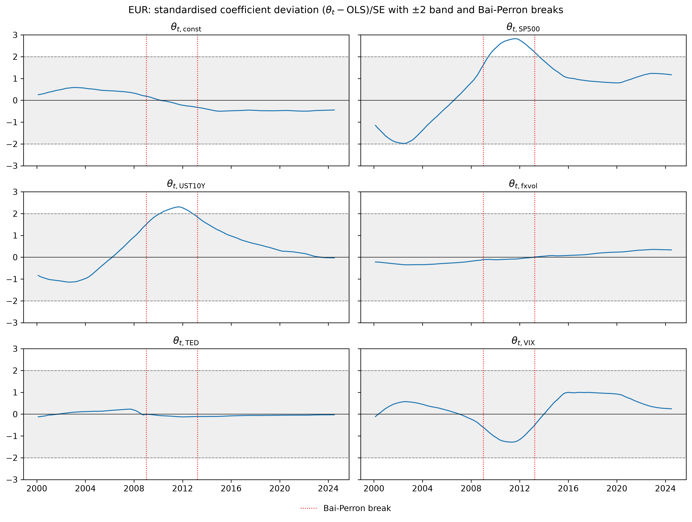

# Results

A plain walk-through of the results, with my reading after each part. The full sample is
2000 to 2024 at daily frequency; OLS uses Newey-West (HAC) standard errors, lag 2.
Significance: \* p<0.1, \*\* p<0.05, \*\*\* p<0.01.

## 1. Static baseline (Table 1)

| | CHF | EUR | GBP | JPY |
|---|---|---|---|---|
| S&P 500 | 0.030** | 0.068*** | 0.085*** | −0.009 |
| UST10Y (Δ yield) | −0.022*** | −0.013*** | −0.008*** | −0.035*** |
| fx volatility | 0.000 | 0.000 | 0.000 | 0.001* |
| TED | −0.066 | −0.084 | −0.215* | 0.119 |
| VIX | 0.004** | 0.002 | 0.000 | 0.009*** |
| R² | 0.040 | 0.023 | 0.029 | 0.141 |
| N | 5,790 | 5,790 | 5,790 | 5,286 |

The S&P 500 correlation is significantly positive for CHF, EUR and GBP, and small and
insignificant (negative) for the JPY. The 10-year Treasury yield is negatively correlated
with all four excess returns, significant throughout. The VIX is significant only for the
CHF and the JPY. The R² is very low for CHF, EUR and GBP; the JPY is the exception at 0.141,
and of that, 0.128 comes from the 10-year yield alone.

**My reading.** The positive S&P 500 sign is the opposite of Ranaldo and Söderlind (2010),
and not what you would expect if these currencies were pure safe havens: a safe haven
should rise when equities fall. As Section 3 shows, the positive sign comes mostly from the
period after the financial crisis. The likely reason is the dollar itself: in stress the
dollar is the currency everyone runs to, so it strengthens even against CHF, EUR and GBP,
which pushes their excess returns down when the S&P falls. The negative yield correlation
(a positive correlation with the bond price) is the interest-rate and carry side of the
same story.

## 2. Structural breaks (Bai-Perron)

| Currency | Break date | 95% CI |
|---|---|---|
| CHF | 2009-03-24 | 2009-02 to 2009-04 |
| | 2013-04-18 | 2012-07 to 2014-05 |
| EUR | 2009-01-07 | 2008-12 to 2009-02 |
| | 2013-03-28 | 2012-09 to 2013-08 |
| GBP | 2008-10-20 | 2008-10 to 2008-10 |
| | 2016-07-14 | 2015-05 to 2018-11 |
| JPY | 2006-06-29 | 2004-12 to 2007-07 |

A narrow interval suggests an abrupt change, a wide one a gradual shift. The GBP's second
break lines up with Brexit (referendum 23 June 2016; Theresa May became PM on 13 July 2016,
the day before). The first breaks of CHF, EUR and GBP all sit in the 2008 to 2009 financial
crisis; the second breaks of EUR and CHF sit in the euro crisis. The one break that does not
match a crisis is the JPY's single break in June 2006. It lines up instead with a turn in
monetary policy (the Fed raising to 5.25% on 29 June 2006, and the Bank of Japan ending its
zero-rate policy on 14 July 2006), which I say plainly rather than force it into the crisis
story.

## 3. OLS by structural-break period

Re-running OLS inside each segment: the S&P 500 correlation strengthens and turns
significantly positive for CHF, EUR and GBP from 2008 to 2009 on. This is the risk, or
flight-to-dollar, channel. In the middle period after the crisis the negative yield
correlation weakens, or even turns positive, so the interest-rate channel matters less
there. The EUR's R² peaks in 2009 to 2013, and the S&P 500 alone explains 15.8% of the
variance in that period (its coefficient is 0.192), which shows how much the risk channel
drove the excess returns right after the crisis.

## 4. Time-varying coefficients (DLM)

The dynamic linear model lets each coefficient drift day by day. Here each coefficient is
shown as its distance from the constant OLS value in standard-error units (the grey ±2 band
is the "no real change" zone; break dates are dotted). The constant, fx-volatility and TED
coefficients barely move; the action is in the S&P 500, the yield and the VIX. The
coefficients leave the ±2 band essentially only for the EUR (S&P 500 and bond) and the GBP
(S&P 500 only). A joint measure over the whole coefficient vector says the same: only the
EUR clearly crosses the 95% line, peaking in mid-2011, right between its two break dates.

**My reading.** I fixed the signal-to-noise ratio at lambda = 1e-3 instead of estimating it,
because the maximum-likelihood estimate collapses to zero time variation (the pile-up
problem); I show the paths under lambda from 1e-4 to 1e-2 so the choice is transparent.
Since the random walk assumes smooth drift, the model shows no sharp jumps, but that is
built into the model, not proof that there are none: a real jump would come out as a smooth
ramp. What I can say is that the biggest moves sit between the structural breaks, where the
coefficients are furthest from their constant value, and clearly so only for the EUR.

## Wrap-up

The full-sample regression, the breaks and the period regressions all say the same thing:
the safe-haven relationships change over time, and the risk and interest-rate channels
behave differently under stress. The breaks fall on the same dates as clear economic and
political events, which I read as likely triggers rather than proven causes. The DLM adds a
continuous-drift view next to the discrete breaks. Because it assumes smooth drift, it
cannot settle gradual vs. jump on its own; a model that allows jumps would be needed for
that, which I leave for later (see `ROADMAP.md`).
